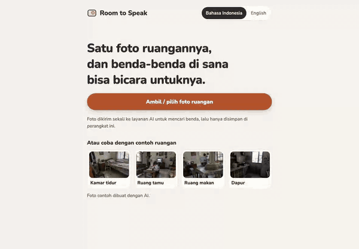
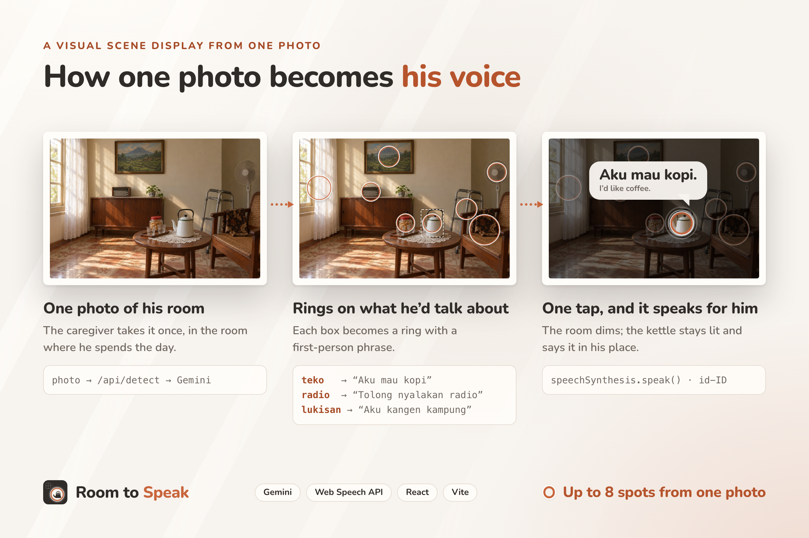

<div align="center">


# Room to Speak 🏠💬

**One photo of his room becomes a voice he can tap.**

**[Try it live → roomspeak.edycu.dev](https://roomspeak.edycu.dev)**

Judging? [The 30-second path (JUDGE.md)](JUDGE.md) · [A real run, with receipts (DEMO.md)](DEMO.md)



[](https://roomspeak.edycu.dev)
[](https://youtu.be/ijFneakCODk)
[](https://roomspeak.edycu.dev/story/)
[](https://roomspeak.edycu.dev/deck/)
[](https://learn-ai-basics.devpost.com/)
[](https://github.com/edycutjong/roomspeak/releases)


[](https://github.com/edycutjong/roomspeak/actions/workflows/ci.yml)

</div>

## 🎬 See it in action

**▶ [Watch the 1:48 demo on YouTube](https://youtu.be/ijFneakCODk)**

<div align="center">
  
</div>

> **Example room → rings on what he'd talk about → one tap speaks.** Real AI output on an AI-generated example bedroom (detection answered by `deepseek-flash`; the wait is trimmed and the GIF has no sound — on a phone the device voice speaks each phrase).

## 💬 What it does

A proof of concept of a **visual scene display**: an AAC tool (augmentative and alternative communication) built from a photo of the user's own surroundings, for adults with **aphasia** after a stroke who understand everything but can't find the words.

1. **Setup (caregiver):** take one photo of the room he spends the day in — or tap one of four example rooms (AI-generated) to try it instantly. Gemini finds up to 8 objects he'd want to talk about and writes a short first-person phrase for each (kettle → “Aku mau kopi”). Rings appear on the photo. The caregiver hears, edits, removes or adds spots.
2. **Speak (him):** the photo fills the screen. One tap on an object and the device speaks the phrase in his language; the rest of the room dims and the object stays lit inside its ring. A row of core words (Ya / Tidak / Tolong / Sakit / Toilet) is always there.
3. The scene is saved on the device. Next time, the app opens straight into Speak mode.



## 🧭 How it works

**Setup happens once and is the only step that needs the internet; everything he does every day runs on the device.**


- **`api/detect.ts`** — the only server code. Keeps API keys off the device, asks for structured JSON, validates every item, and walks a fallback ladder within a 55 s budget when a model is busy or slow. A provider without a key is skipped:

  | Order | Model | Measured on 6 test rooms |
  |---|---|---|
  | 1 | `gemini-3.8-flash` | tightest boxes, ~4–12 s |
  | 2 | `gemini-3.1-flash-lite` | accurate boxes, ~3–10 s, picks slightly more trivial objects |
  | 3 | `deepseek-flash` (DeepSeek API, V4.1 Flash, low effort) | good, slightly looser boxes, ~6–10 s |

  Also benchmarked and left out: OpenAI `gpt-5.4-mini` (fast, but loose boxes), Qwen 3.8 Flash (accurate, ~35 s), and free OpenRouter vision models (rate-limited or timed out on most calls).
- **`src/components/PhotoStage.tsx`** — the photo at its own aspect ratio with rings as real, labelled buttons. A tap counts on release inside the same ring it started in; a second finger cancels it (resting palms don't speak).
- **`src/speech.ts`** — device voice, interrupt-then-speak, large-text fallback when no matching voice exists.
- **`src/scene.ts`** — one scene in `localStorage`; nothing is stored on a server.

A one-page code guide lives in [`devpost/app-map.html`](devpost/app-map.html).


## 🚀 Try it locally

Requires Node 22+ and a [Gemini API key](https://aistudio.google.com/apikey).

```bash
npm install
GEMINI_API_KEY=your-key npm run dev        # or put it in .env.local (see .env.example)
# optional fallback: DEEPSEEK_API_KEY
# open http://localhost:5173 — add `-- --host` to try it on a phone on the same wifi
```

Use a phone or tablet with an Indonesian voice installed for speech in Bahasa Indonesia (Android Chrome and iOS Safari ship one). English is available at setup.

## 🧪 Tests & CI

Every command below runs without an API key except the last one, `slice1-detect.mjs`, which makes a real detection call (Gemini, or the DeepSeek fallback). [CI](.github/workflows/ci.yml) runs typecheck → tests → build → browser specs on every push and pull request. [gitleaks](.github/workflows/gitleaks.yml) scans each push for secrets, and the full git history weekly and on demand.

```bash
npm run typecheck                                   # tsc -b, strict
npm test                                            # 25 Vitest tests
npm run coverage                                    # the same tests, with a v8 coverage report over src/, shared/ and api/
npm run e2e                                         # build, then 2 Playwright specs on vite preview (detection + voice stubbed)
BASE_URL=https://roomspeak.edycu.dev npx playwright test   # the same specs against the live site, after a deploy
node e2e/slice2-speak.mjs path/to/room-photo.jpg    # build-time browser checks on `npm run dev`, detection stubbed; also slice3–5
node e2e/slice1-detect.mjs path/to/room-photo.jpg   # needs a key: start the dev server with GEMINI_API_KEY (or DEEPSEEK_API_KEY) set
```

- **17 unit tests:** validation, model-JSON parsing, box → ring, hit testing, ring separation, storage.
- **3 regression tests, each named for a defect the build hit:** a Gemini timeout escaping the fallback loop ([863498a](https://github.com/edycutjong/roomspeak/commit/863498a)), a 503 "high demand" on the first real call ([6edd9ca](https://github.com/edycutjong/roomspeak/commit/6edd9ca)), and extensionless imports that broke only on Vercel ([cf62a94](https://github.com/edycutjong/roomspeak/commit/cf62a94)). One more covers fenced JSON from the DeepSeek fallback.
- **1 property test over 100,000 generated model answers:** [fast-check](https://fast-check.dev) builds answers from spots that are valid or invalid by construction. `validateSpots` never returns a box outside 0–1000, a box with min ≥ max, a blank phrase or more than 8 spots, and never drops a valid spot before the cap.
- **3 no-key checks:** the client is built with canary keys in the environment; the keys, key-shaped strings and the AI providers' URLs appear in no file the browser downloads.
- **Browser:** 2 Playwright specs in CI (the [`/judge`](JUDGE.md) page, and the 30-second path it prints), plus the 5 `e2e/slice*.mjs` scripts used during the build: 43 checks across Speak mode, editing, persistence, failure states and example rooms. `slice1-detect.mjs` makes a real detection call, so it needs a key with quota left; when detection fails it stops with the server's reason instead of waiting. The other four stub detection.

The real, unstubbed run is [DEMO.md](DEMO.md) (`npm run receipt`).

## 🛠️ How it was built

Planned and built with the [Devpost Learn skill pack](https://github.com/challengepost/learn-ai-basics) — the planning documents are in [`devpost/`](devpost/): [`scope.md`](devpost/scope.md) → [`prd.md`](devpost/prd.md) → [`spec.md`](devpost/spec.md) → [`checklist.md`](devpost/checklist.md) (build slices, verification, and every plan revision the build forced).

## ⚠️ Limits of this proof of concept

- A communication-aid prototype, **not** a medical device or therapy; no clinical claims.
- One room, one device, device voice only. A recorded family voice, more scenes and sharing between family members are out of scope.
- Detection quality depends on the photo; the caregiver can always remove, rename or add spots by hand.
- The room photo in the images above is AI-generated for illustration.

## 📄 License

[MIT](LICENSE)
